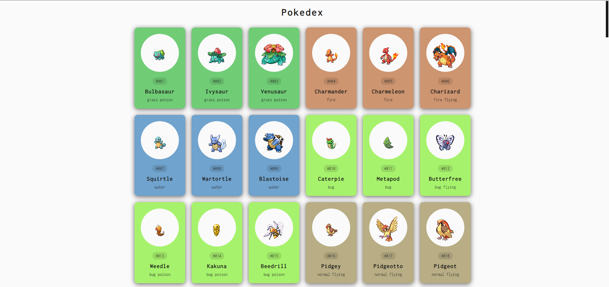

<h1 align="center">
 Pokedex
</h1>
<h2 align="center">
 Pequena pokedex em desenvolvimento
</h2>

<h3 align="center">
  📂 Tecnologias utlizadas no projeto 📂
</h3>

   <h4 align="center"> <strong> HTML </strong> </h4>
   <h4 align="center"> <strong> CSS </strong> </h4>
   <h4 align="center"> <strong> JavaScript </strong> </h4>

